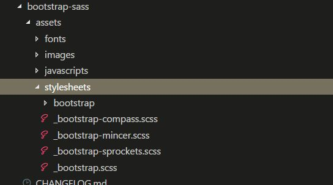
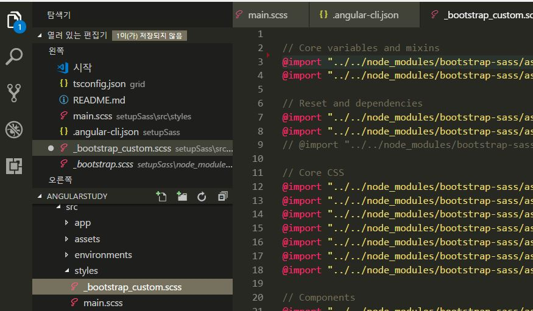

 # angularStudy

## Angular Component - Interaction
[컴포넌트 간의 상태 공유](link)
- ng g c childComponentName (자식 컴포넌트)
- 자식 Directive의 select프로퍼티에 지정한 이름 'app-user-list' 
- 부모 컴포넌트에서 추가 할 수 있다.
- npm install bootstrap
- 경로 .angular-cli.json styles에 
- "../node_modules/bootstrap/dist/css/bootstrap.min.css", 추가.

[@Input 데코레이터](link)
- 부모 컴포넌트에서 자식 컴포넌트로 상태 전달
- form 요소를 가지고 있는 부모 컴포넌트의 경우, 사용자에 의해 상태(state)가 변경되면 자식 컴포넌트와 공유할 필요가 있다.
- 부모 컴포넌트는 프로퍼티 바인딩을 통해 자식 컴포넌트에게 상태 정보를 전달한다.
- ex) aa <app-user-list [users]="users"></app-user-list>

```
//property binding 
//state : myState
<child [state]="myState"></child>
@input() state:string;

// v1, v2, v3, v4
// node-sass

// social login
// login, search engine
// 여행자 찾기 위치 다음에 재능 갈 위치, 갈 위치, 

```

### [Sass integration]
#### Reference 
- https://www.youtube.com/watch?v=Hl2veCbHbeo&t=9s
#### step 1
-  when generating a new project
```
ng new sassy-project --style=sass
```
- angular-cli.json style.sass 로 기본 세팅이 되어있음.

-  or set the default style on an existing project
```
ng set defaults.styleExt scss
```
- .angular-cli.json defaults styleExt value 바뀜
```
"defaults": {
    "styleExt": "scss",
    "class": {
      "spec": false
    }
```
#### step 2
+ 기존 프로젝트 후에 sass를 설치 한 경우
  + style.css 를 style.scss 
  + angular-cli.json 아래와 같이 바꿔주기 
  ```
   "styles": [
        "styles.scss"
      ]
  ```

### step 3
+ noramalize.css , bootstrap custom 연결 방법
 + 기본 style.css 지우고 styles폴더 안에 main.scss
 ```
  "styles":[
      "styles/main.scss"
  ]
 ```
  + bootstrap-sass 설치
  ```
  npm i -S bootstrap-sass
  ```
  + node_modules > bootstrap-sass > assets > stylesheets > bootstrap.scss <br> bootstrap.scss 에 import 한게 다 있다. 복사를 한다.

  
  
  + 전역 styles/bootstrap_custom.scss 붙여넣기를 한다. 경로 아래와 같이 수정
  ```
  @import "../../node_modules/bootstrap-sass/assets/stylesheets/bootstrap/variables"
  ```
  
  + 전역 styles/main.scss import 한다.
  
  ``` 
  @import "bootstrap_custom.scss";
  ```

  ![img3]

[//]: # (These are reference links used in the body of this note and get stripped out when the markdown processor does its job. There is no need to format nicely because it shouldn't be seen. Thanks SO - http://stackoverflow.com/questions/4823468/store-comments-in-markdown-syntax)
   [img1]: 
   [img2]: 
   [img3]:  
   [Sass integration]: <https://github.com/yuriyoon1009/angularStudy/tree/master/setupSass/src/styles>
